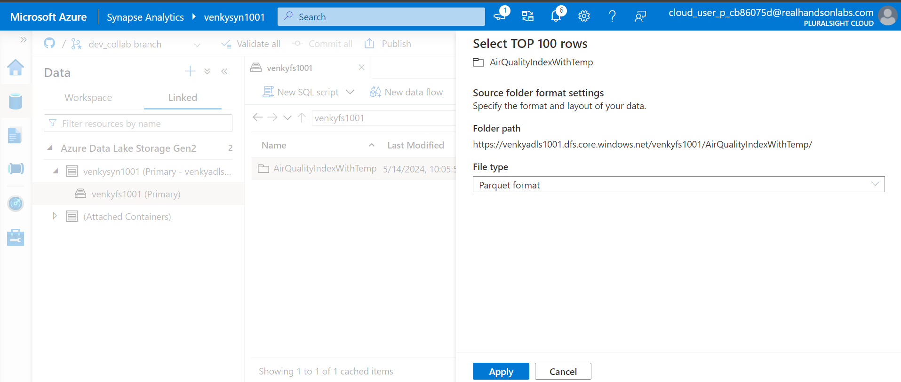
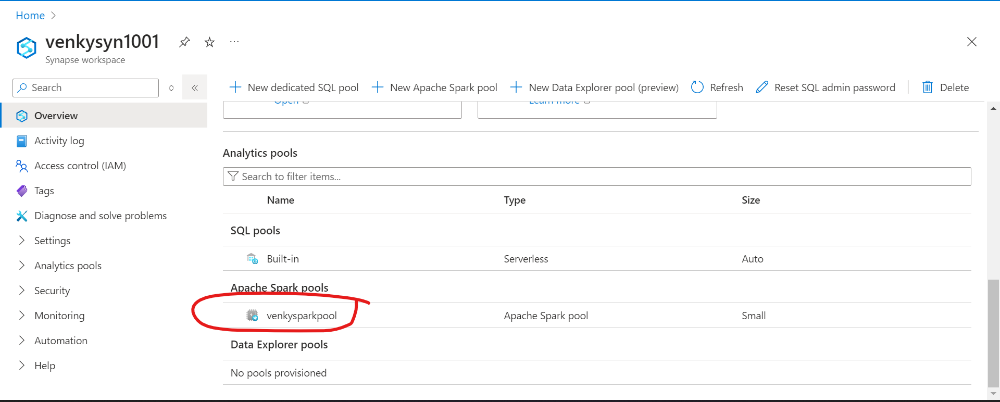

## Azure Synapse Git Integration Testing

* This experiment will test how Azure Synapse integrates with GitHub. As we create multiple artifacts inside Synapse as a developer, we can make sure multiple developers can work in parallel and not step on each other using the version control mechanisms that Synapse Git Integration supports. 

* First we need to create a Synapse workspace. As we can see an ADLS storage account and Synapse workspace have been provisioned. 

* Opening the Synapse Studio should look like this

* Now we will connect this synapse workspace to a blank git repository to allow us to demonstrate the usage of the version control capabilities. 

