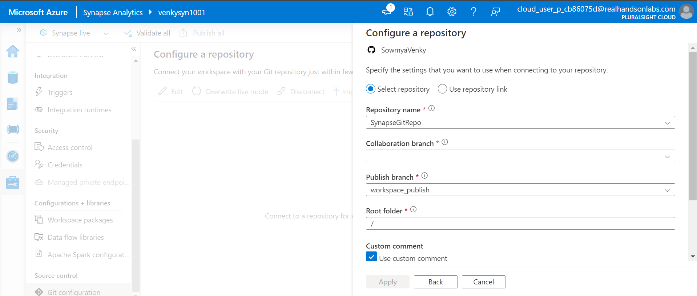
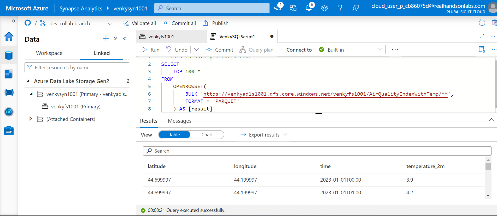

## Azure Synapse Git Integration Testing

* This experiment will test how Azure Synapse integrates with GitHub. As we create multiple artifacts inside Synapse as a developer, we can make sure multiple developers can work in parallel and not step on each other using the version control mechanisms that Synapse Git Integration supports. 

* First we need to create a Synapse workspace. As we can see an ADLS storage account and Synapse workspace have been provisioned. 

* Opening the Synapse Studio should look like this

* Now we will connect this synapse workspace to a blank git repository to allow us to demonstrate the usage of the version control capabilities. 

* We are creating a blank repository on our personal github to test the integration.
  

* Selecting the type of SCM and specifying the repository owner to allow for Synapse to make the connection to it. Usually another pop-up screen appears and it will ask us to login to the repository with the username and password for the repository.
  

* We need to create a new collaboration branch for the users to collaborate and make changes. As we can see there is another branch called the workspace publish branch that allows the merges to happen to the branch that can be used for publishing to other higher regions.
  

* After the connection to github happens, we can see that Synapse goes ahead and creates the required folders in the collaboration branch we had specified. As we can see, there are separate folders for separate Synapse artifacts.
  

* Now that we have the Synapse workspace created with the serverless pool, we can upload some data from our local machine and try to query that with serverless pools, notebooks, and pipelines. We will observe the artifacts that get created as we move through these processes.
  

* As we can observe here, all the datasets that we used for the air quality and temperatures experiments before have been uploaded into the same folder under the ADLS container.
  

* We can use the serverless SQL pool capability of Synapse and do a simple query on all the parquet files in the folder via the openrowset command.
  

* As we can see there is no Publish button like how it would be in the live mode. It is now having the validate all and commit all buttons. Once we click these the source is integrated and pushed directly to git as opposed to hitting the Synapse live service. We can specify the commit messages to use when committing, and once the commit happens the new version of the code is pushed to git and can be seen. 
  

* We can also create the external table pointing to the location inside the ADLS storage. This gets exposed as a lakehouse database and an external lakehouse table as can be seen in the images.
  

* To use the data pipeline capabilities of Synapse, we will need to start creating the following artifacts - Synapse linked services, Synapse Integration Datasets, Synapse Pipelines. These allow the user to do a visual ETL as opposed to doing it in code via Spark.
  

* We will now go ahead and create a spark pool for allowing us to run Spark notebooks. We have selected a non-autoscaling 3 node small spark cluster for testing purposes.
  

* This is certainly an acloud guru limitation. The acloud guru sandbox user does not have the required permissions to allow us to take the Synapse SMI and add it to the storage account to give it the Storage Blob Data Contributor. I tried to set the ACLs but none of this worked. The only way to get it to work is to create another linked service using the access keys and then use that linked service to run the pipelines. This is definitely not recommended in production, but is an acceptable work-around for this testing.

* As can be seen here, we have created a notebook, tested it and are now committing that to the github repository. As we can see we are creating a new table inside the default database available in spark.
  

* The same notebook can be added to a pipeline. This can be triggered but it fails since the SMI does not have access to the storage account. There are some spark settings we can set to allow it to force the connection via the second linked service.
  

* This demonstrates a simple data copy pipeline. The data is taken from the main parquet folder and then pushed to another folder in JSON format. Essentially we create 1 linked service to establish connections to ADLS, 2 integration datasets one for the source side and one for the sink side and create a pipeline with a copy task to enable the copy to happen while converting from parquet to JSON.

* Notice here that we are creating a new linked service that maps to the storage account via the access keys. This is not recommended in prod, but this is the only way we can get Synapse pipelines to work inside acloud guru sandbox. 

* This is the sink dataset, in JSON format. Note both use the newly created linked service to get to the storage account.

* Next we need to try to take all these artifacts from one Synapse workspace and push it to another Synapse workspace. The fabric migration project gives us some sample scripts that we can use.
* https://github.com/microsoft/fabric-migration/blob/main/data-engineering/utils/util.py
  
